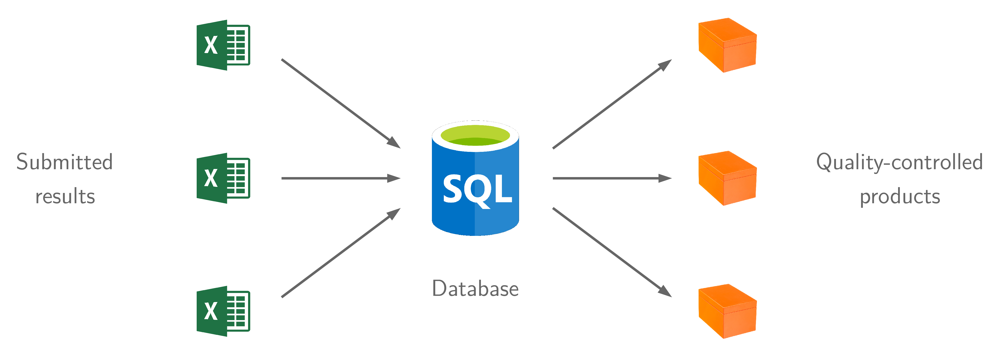

# STAR

Stock Assessment Results (STAR) is a new framework to organize
[GFCM](http://www.fao.org/gfcm/en/) stock assessment results.

It streamlines and automates the **information flow** from stock assessments to
scientific advice, strengthens **quality assurance** and **data dissemination**.

The central part of the framework will be the STAR database, scheduled to launch
in 2021. It will serve as a foundation to provide a variety of
quality-controlled data products related to the management of fisheries in the
Mediterranean and the Black Sea.

## Download newest Excel template

**Version 2.0.0**

*12 Apr 2021*

* [star-template.xlsx](https://github.com/gfcm/star/releases/download/2.0.0/star_template.xlsx)
* [NEWS.md](https://github.com/gfcm/star/blob/main/NEWS.md)

## User documentation

Guidelines for users are provided in four places:

1. Overview of the STAR framework and wider context in the launch event
   [presentation](2021_01_18_launch_event.pdf)
2. Usage comments within the
   [Excel template](https://github.com/gfcm/star/raw/main/star_template.xlsx)
   sheets
3. Sheet highlighting the [logic](logic.pdf) behind the Excel formulas
4. Changes between versions are listed in the [NEWS.md](NEWS.md) file
